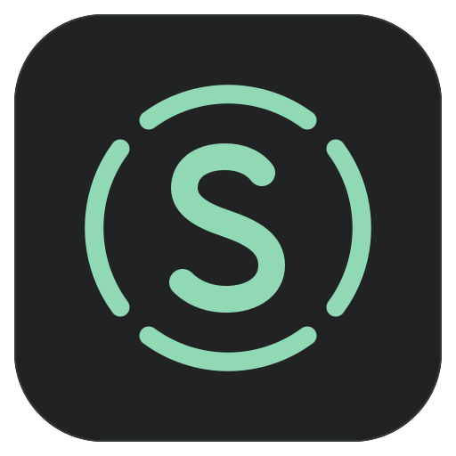

# SDA — Spatial Decoder Atelier

**空间音频解码、双耳渲染与录音棚仿真工作台。**

SDA 将本地音频中的声床、声音对象及其空间元数据接入自己的渲染引擎，让耳机听者体验环绕声场，并在三维视图中查看声音的位置与运动。除了播放，SDA 还提供房间仿真、监听处理、耳廓档案、耳机音色模拟，以及手机和平板网页远程收听。

**目前仍在测试开发中。** 当前主要运行平台为 Windows 桌面端；不同编码、元数据和渲染功能的支持范围见下文。支持播放不等于完整实现对应格式的所有功能，也不代表获得 Dolby、DTS 或 Sony 认证。

## 主要功能

### 空间解码与三维声场

- 读取受支持内容的声床与独立对象 PCM，并保留位置、增益、宽度／扩散和时间信息。
- 三维视图展示对象、名称、扬声器布局和运动轨迹；提供对象、声道与码流信息面板，以及静音、独奏等检查操作。
- 支持常见环绕与高度布局，包括 2.0、5.1、7.1.4、9.1.4、9.1.6，以及扩展的 11.1.8、22.2 和 360RA 布局。**这些首先是渲染与显示布局，不代表声卡会输出相同数量的物理声道。**
- MPEG-H / 360RA 对象使用包含下半球的球形声场视图。

### 双耳渲染与耳廓档案

- 虚拟扬声器双耳渲染、逐对象 HRTF 和连续方向处理。
- 对象声源面积、扩散与近场处理；实际作用取决于解码出的元数据、启用路径和当前设置。
- 内置多个人头／耳廓测量档案，可切换、导入个人 SOFA，以及管理个人档案。
- 参数化个人 HRTF 测试可按当前布局生成、保存、切换、导入和导出档案。此功能仍属实验：主观确认不等于客观测量，也不保证每位听者的定位都改善。

### 房间仿真与监听

- 内置预计算房间档案：**2.0、5.1、7.1.4、9.1.4、9.1.6、360RA-13、22.2、11.1.8**。安装后可直接使用，无需用户部署 Python、AI 模型或下载测量数据库。
- 房间处理包含直达声与反射，可查看布局和声传播路径，并按节目布局使用匹配档案。
- 监听面板提供总监听电平、DIM、静音、逐输出电平／延时／极性与低频管理；房间声学与监听控制分别配置。
- 可选电气链路模型描述 DAC 量化、带宽、输出阻抗与削波等行为。它是工程近似，**不是对某台商业功放或声卡的完整实测复刻**。
- 自定义房间生成仍可使用；生成新档案需要另外配置科学计算运行环境。内置房间不依赖该环境。

房间档案结合公开测量响应与几何声学仿真；房间尺寸、材料覆盖率和摆位包含 SDA 的设计假设，不宣称是某间真实录音棚的测量复原。

### 耳机音色与播放管理

- 选择实际佩戴耳机与目标耳机，近似比较不同耳机的频响音色；默认可选「通用耳机（未校准）」。
- 耳机模拟不等于完整复制目标耳机的佩戴、ANC、失真或空间感；界面中的互斥规则用于避免叠加冲突的处理。
- 音量平衡只用于立体声节目，不作为 Atmos／ADM 对象母版的统一归一化开关。
- 播放列表、上一曲／下一曲、顺序播放、列表循环、单曲循环、最近打开与收藏目录。
- 深浅主题、玻璃质感迷你播放器、自定义文件选择器和浮动面板。

### 沉浸视图

进入「沉浸」后可全屏探索声场，用 WASD 移动、Shift 加速、F5 切换视角、F6 回到原点，双击空格切换飞行。第三人称角色支持 Minecraft 兼容 PNG 皮肤。

这是声场可视化的浏览方式；相机移动不应被理解为完整的 VR 音频或设备支持。

## 音频格式与支持边界

文件扩展名只表示容器或传输形式。能否解码对象取决于文件实际包含的编码和元数据；固定高度声道不会因为显示在三维空间中就被当作对象。

| 内容 | 当前支持 | 主要边界 |
| --- | --- | --- |
| Dolby TrueHD / Atmos、AC-3 / E-AC-3 JOC | 受支持码流的声道／对象解码与空间事件 | 对象数量与可用元数据以解码结果为准 |
| DTS / DTS-HD / DTS:X | Core、XLL，以及上游已解析的 DTS:X 对象与固定高度声道 | DTS:X 属实验兼容；不覆盖所有扩展、传输形式和私有元数据 |
| AC-4 Full A-JOC | 重建空间组 PCM 与 OAMD，接入 SDA 渲染 | 重建组不等于原始工程分轨；不支持所有 presentation；**IMS 空间播放尚未实现** |
| ADM/BWF PCM 母版 | RIFF / RF64 / BW64，`axml` + `chna`，声床、对象与时间事件 | 支持 16/24/32-bit PCM 和 32/64-bit float，最多 128 轨；不等于完整 ADM 规范实现 |
| MPEG-H / Sony 360 Reality Audio | MHAS、MP4 `mha1` / `mhm1`；对象 PCM 与 OAM | 纯声道／纯 HOA 当前使用上游双声道结果；混合 HOA／对象及部分扩展不支持 |
| IAMF | 当前工作树接入原始 `.iamf`、48 kHz LPCM 和对象元数据 | 实验接入；不支持压缩 codec 与 MP4 IAMF，不宣称完整 Advanced-2 兼容 |
| 普通 PCM WAVE、ALAC | 受支持的 PCM／ALAC 播放与立体声路径 | 不因容器名为 `.m4a` 就保证支持其中任意 codec |

常见入口包括 MKV、MP4／M4A、WAV 母版和相应裸码流。当前面向**本地、未加密文件**，不提供流媒体平台登录、DRM 解密或商业歌曲下载。

格式细节：[ADM](docs/adm-playback.md) · [DTS:X](docs/dts-x-support-2026-09-14.md) · [AC-4](docs/ac4-playback.md) · [IMS 研究](docs/ac4-ims.md) · [MPEG-H / 360RA](docs/mpegh-support.md) · [IAMF](docs/iamf-research.md)。

## Windows 桌面与网页远程

### 本机播放

打开文件或添加文件夹，在「系统设置 → 音频输出设备」选择系统默认或指定设备。Windows 桌面通过 Rust 原生渲染器与 WASAPI 输出，支持共享、独占及 UU／RDP 远程兼容模式。

**当前桌面原生输出为双声道。** 多声道／对象在 SDA 中渲染到左右耳；即使声卡有更多通道，也不能把此路径理解为多声道物理直通。共享输出仍可能受到 Windows 混音和系统音效影响。

### 手机、iPad 与其他电脑收听

1. 主机打开「系统设置 → 无线远程」，设置端口、缓冲和同时连接上限，开启发送。
2. 复制网页链接，在局域网或 Tailscale／ZeroTier 组网中的浏览器打开。首次访问需确认主机的自签名 HTTPS 证书。
3. 输入配对密钥并申请连接；主机可批准「仅收听」或「收听与控制」。授权设备可记住连接，主机可撤销权限或断开设备。
4. 网页端可控制播放、查看封面与歌手、滑动切换播放卡片／列表／三维声场，访问主机收藏和最近打开，并操作房间、监听、耳廓及音量平衡等设置。

同时连接上限可由用户设置为 **1–16 台**，实际承载能力取决于主机与网络。自定义密钥可保存，未填写时由主机生成；配对链接含凭据，请只分享给可信设备。默认 TCP 端口为 `49632`，网络必须能访问所选端口。

传给客户端的是 **SDA 已完成双耳、房间等处理的双声道结果**，不是原始歌曲文件或未渲染的对象：

- **低延迟 PCM**：48 kHz、双声道 float32，经 WSS 传输，音频有效载荷约 3.072 Mbps。
- **HLS 原生播放**：FLAC／fMP4 通路，由电脑端设置是否允许，默认禁用；有 24-bit 量化与额外媒体缓冲。
- 提供播放／加载状态同步及后台媒体控制。Safari / iOS 的后台持续播放、原生媒体行为和实际延迟仍受系统、浏览器版本及网络条件影响。
- 「电脑端静音」用于远程收听时控制本机发声；远程收听不依赖 UU 或 RDP 保持连接。

网络无损传输不等于最终 DAC 位完美输出：浏览器、系统混音、重采样及设备音量仍可能改变物理输出。详情见[远程播放文档](docs/lossless-remote.md)。

## 当前架构

```text
本地媒体文件
  → 流式解封装 / PCM 与 ADM 读取
  → Decoder Worker：Rust WASM + MPEG-H / IAMF 独立 WASM 模块
  → 声床 PCM、对象 PCM、按采样时间排列的空间事件
      ├─ Windows 桌面：Electron → Rust 原生渲染器 → WASAPI 双声道输出
      │                                      └─ HTTPS/WSS/HLS → 网页远程客户端
      └─ 独立网页版：Web Audio / AudioWorklet 渲染路径

React + Three.js：播放控制、设置与声场可视化
```

解码与音频渲染分工独立：桌面不是仅靠网页 AudioWorklet 发声，也不是把所有解码都搬进原生引擎。房间响应、HRTF、对象路径和监听路由存在分流与合成关系，不是把几个音效依次串联。

Windows 原生引擎以 48 kHz 为内部渲染时钟。大量对象、长房间响应与逐对象处理会增加 CPU 和缓存开销；性能与实时性取决于文件、设置和设备。

## 从源码运行

以下命令在仓库根目录执行，面向 Windows 开发环境。安装包用户不需要这些工具链。

### 1. 工具与源码

| 工具 | 用途 |
| --- | --- |
| Git、Node.js ≥ 20、pnpm 9 | 工作区依赖与前端构建；当前开发使用 Node.js 24 |
| Rust / rustup | 原生组件；解码核心由 `packages/core/rust-toolchain.toml` 固定到 1.98.0 |
| `wasm32-unknown-unknown`、`wasm-bindgen-cli 0.2.127` | Rust WASM 构建；CLI 版本须与核心 Cargo.lock 一致 |
| Python 3 + pip | AC-4 规范表准备；不属于普通用户播放依赖 |
| Emscripten 4.0.15 | MPEG-H 与 IAMF 的独立 WASM 模块 |
| Windows MSVC C++ 构建工具与 Windows SDK | Rust Windows 原生组件的编译和链接 |

```powershell
git clone --recurse-submodules https://github.com/fengluoxiao/SDA.git
cd SDA
pnpm install --frozen-lockfile

# 已克隆但缺少子模块时执行
git submodule update --init --recursive

rustup toolchain install 1.98.0 --profile minimal --target wasm32-unknown-unknown
cargo install wasm-bindgen-cli --version 0.2.127 --locked
```

上游依赖按当前子模块与锁文件读取，不再手工固定 README 中的历史提交号。

### 2. 构建解码模块

```powershell
# 首次准备 AC-4 表：需要联网、Git 和 Python
node scripts/prepare-ac4.mjs
pnpm core:build

# 配好 Emscripten 后构建独立模块
pnpm mpegh:build
pnpm iamf:build
```

Emscripten 需先安装并激活。脚本默认查找 `tmp/emsdk`；使用其他安装位置时，设置 `EMCC` 为 `emcc.py` 的完整路径、`EMSDK_PYTHON` 为可用 Python 的完整路径。MPEG-H 脚本会获取固定版本的上游源码；IAMF 使用 `vendor/libiamf` 中的源码。详见各格式文档。

当前播放器直接引用这些 WASM 模块，因此仅执行 `core:build` 不足以完成全部前端依赖。生成产物是否已在工作区中可用，应以实际文件为准。

### 3. 准备原生依赖与启动

原生组件的日常构建使用 `--locked --offline`，新电脑应先下载 Cargo 依赖：

```powershell
cargo fetch --manifest-path apps/native-renderer/Cargo.toml --locked
cargo fetch --manifest-path apps/head-tracking-helper/Cargo.toml --locked

# 同时启动 Vite 与 Electron；桌面脚本会构建原生组件和远程网页资源
pnpm dev
```

也可在两个终端分别运行 `pnpm web:dev` 与 `pnpm desktop:dev`。桌面开发模式默认访问 `http://localhost:5173`，可通过 `SDA_DEV_URL` 指定地址。

```powershell
# 构建网页与远程网页资源
pnpm web:build

# 使用已有原生组件与生产网页启动 Electron
pnpm --filter @sda/desktop exec electron .
```

内置 HRTF 与房间资源已随项目提供，日常构建无需重新生成。原生构建脚本会把所需 HRTF 复制到桌面资源目录；不要用早期的单主体生成步骤覆盖现有整套档案。

### 4. 打包 Windows 安装包

```powershell
pnpm --filter @sda/desktop build -- --win nsis --x64 --publish never
```

此命令构建原生组件、暂存驱动包、构建网页并运行 electron-builder；解码 WASM 需先按上文准备。

- 安装包：`apps/desktop/dist/SDA Setup <version>-x64.exe`。
- 解包目录：`apps/desktop/dist/win-unpacked/`。
- 已配置 SDA 自有窗口、可执行文件和安装器图标，`signAndEditExecutable` 已开启；图标资源写入不等于拥有发行签名证书。
- 如果 Windows 解压构建工具时报告符号链接权限错误，检查开发者模式／构建环境权限，不要通过关闭可执行文件资源写入来退回 Electron 默认图标。

普通播放不需要安装实验性设备驱动。相关组件的安装、恢复、构建与许可证说明见[Windows 设备集成文档](docs/windows-head-tracking-install.md)。仓库现有 CI 工作流包含历史预览配置；全新环境应以此处列出的完整依赖为准。

## 工程目录

| 路径 | 职责 |
| --- | --- |
| `apps/web` | 桌面共用的 React UI、Three.js 声场、独立网页入口及远程网页源模块 |
| `apps/desktop` | Electron 主进程、设置／档案服务、文件访问、远程服务和打包资源 |
| `apps/native-renderer` | Rust 原生双耳渲染、房间／监听处理、WASAPI 与远程 PCM 输出 |
| `apps/desktop/remote-web` | 随主机分发的手机／平板／桌面浏览器客户端 |
| `packages/core` | Rust 解码核心，以及 MPEG-H / IAMF WASM 接口 |
| `packages/demux` | 容器解封装、PCM WAVE 与 ADM 元数据读取 |
| `packages/player` | Decoder Worker、预读、采样时间轴、PCM 与对象事件调度 |
| `packages/renderer` | 浏览器音频渲染、空间路由与共享算法 |
| `apps/mobile` | Expo 原生客户端原型；尚不是完整的独立手机播放器 |
| `harletty-bridge`、`vendor` | 上游解码依赖与适配源码；许可分别保留 |
| `scripts`、`docs` | 构建／验证工具、实现说明与研究记录 |

`apps/mobile` 原型与已可使用的网页远程客户端是两条不同路径。当前手机收听应从桌面主机的网页链接进入。

## 验证与技术文档

按改动范围选择验证；部分格式测试需要对应 WASM、上游测试向量或本地文件：

```powershell
pnpm --filter @sda/core test
node scripts/test-adm.mjs
pnpm mpegh:test
pnpm iamf:test
pnpm acoustics:test
node scripts/test/playback-order.test.cjs
pnpm web:build
```

- 渲染：[信号流程](docs/rendering-signal-flow.md)、[逐对象 HRTF](docs/direct-object-hrtf.md)、[连续方向](docs/directional-hrtf.md)、[声源面积](docs/source-extent.md)、[近场](docs/near-field.md)。
- 声学：[内置房间](docs/builtin-reference-rooms.md)、[房间实验室](docs/room-lab.md)、[监听](docs/monitor-processor.md)、[电气模型](docs/hardware-model.md)。
- 个性化：[个人 HRTF](docs/personal-hrtf.md)、[耳机音色模拟](docs/headphone-simulation.md)。
- 播放：[输出设备](docs/audio-output-management.md)、[无线远程](docs/lossless-remote.md)、[循环模式](docs/playback-modes.md)、[沉浸操作](docs/immersive-navigation.md)、[像素皮肤](docs/pixel-avatar-skins.md)。

## 来源与许可

各组件与数据按各自许可证分发，不能将整个安装包笼统视为单一许可证：

- Rust 解码核心的包声明为 Apache-2.0；TrueHD、E-AC-3、DTS 等依赖按各上游版本保留来源与许可，包括 [harletty-bridge](https://github.com/harletty/harletty-bridge)。
- AC-4 使用 [MacinDecode-AC4-Core](https://github.com/SakuzyPeng/MacinDecode-AC4-Core)（MIT）及 SDA 的场景适配。
- MPEG-H 使用 [Ittiam libmpegh](https://github.com/ittiam-systems/libmpegh)，保留 `LICENSE` 和 `LICENSE2`；源码许可与专利许可是不同事项。
- IAMF 使用 AOMedia 的 libiamf / OAR，保留各自 `LICENSE`、`PATENTS` 与上游版本记录。
- `apps/native-renderer` 与独立设备 helper 声明为 GPL-3.0-or-later；helper 的协议研究归属 [LibrePods](https://github.com/librepods-org/librepods)。Windows profile 驱动保留 Microsoft Public License 与版权声明。
- HRTF／BRIR、房间和耳机响应数据按资产目录中的来源、许可与生成说明使用；SADIE II 数据库采用 Apache-2.0。

Dolby、DTS、Sony、Apple 等名称和商标属于各自权利人。本仓库不分发商业歌曲或未获授权的母版内容。
